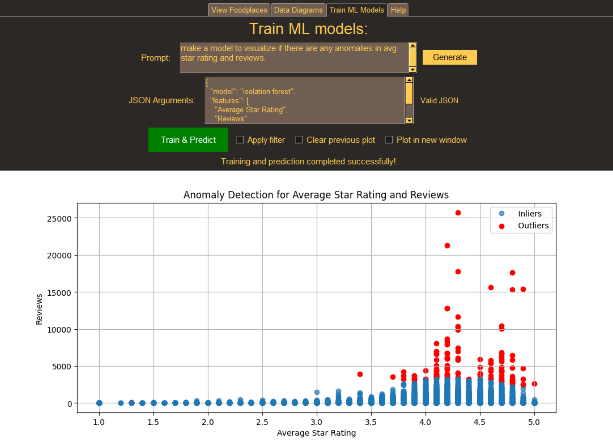

# Instructions for Using the PySimpleGUI Application for Data Visualisation and Analysis

## DISCLAIMER: 
## THIS GUI APPLICATION WORKS BEST WITH A COMPUTER SYSTEM SCALE OF 125%. PLEASE ADJUST BASE ON YOUR COMPUTER SYSTEM'S SCALE THAT GIVES YOU THE BEST VIEW.

## <ins>1. View Foodplaces Tab</ins>

The View Foodplaces tab is used to view the list of foodplaces in Singapore on the map where users can set up to 3 filters -- fiiltering by either entering a Prompt or JSON filter, filtering by the Areas of Singapore, filtering by the Categories of Foodplaces.

### <ins> Basic Use </ins>

### <ins>A1. Filtering based on Prompt</ins>
Prompt provides users the flexibility to enter any query they want on how the data can be filtered and then visualised.

1. To begin, enter a Prompt. Only 1 Prompt can be entered at a time. A Prompt example "dine in and takeaway and region is central and top 10 on bayesian rating" has ben provided in the Prompt box.

Examples of Prompt for Filtering:
- list all the restaurants in the east
- dinein and takeaway and region is central and top 10 on bayesian rating
- top 100 based on avg star ratign and the 10 least pricey
- top 3 lowest bayesian rating
- top 100 based on relevancy and the 10 earliest to open

2. Click on the "Generate" button. **(FOR THIS METHOD ONLY)**

### <ins>B. Filtering based on Areas of Singapore</ins>
1. To begin, select the Areas of Singapore that you will want to view the foodplaces from in the list. Multiple selections are allowed. A highlighted yellow field shows that the area has been selected. Unselect by clicking the same highlighted area. 
   
### <ins>C. Filtering based on Categories of Foodplaces</ins>
1. To begin, select the Categories of Foodplaces that you will want to view the foodplaces from in the list. Multiple selections are allowed. A highlighted yellow field shows that the category has been selected. Unselect by clicking the same highlighted category.

### <ins> A2. Filtering by JSON Filter</ins>

#### <ins>(i). Editing JSON filter after Prompt generation </ins>
1. The JSON filter that is generated after entering the Prompt and clicking on the "Generate" button can also be edited.

**NOTE: Configurations done on the JSON filter after pressing the "Generate" button will override the result produced on the map**.

#### <ins>(ii). Manual Entering of JSON Filter</ins>
1. Users can also manually type in the JSON filter into the GUI.

### <ins> To View Results for ALL Filtering Methods - A1, A2, B and C (after the above steps mentioned are completed)</ins>

<ins> **(FOR A2, B, C)**</ins>
**NOTE: DO NOT need to click on the "Generate" button to display the result.**

3. View and Display the data results on the map by clicking on one of the 2 map options (green buttons).
4. To save a copy of the map, click "Export Map". Save the map HTML file at the desired location of your file system.
5. To save a copy of the filtered dataet, click "Export Filtered Dataset". Save the filtered dataset CSV file at the desired location of your file system.

### <ins>Combining Filters</ins>
Users can filter the dataset **UP TO 3 filters**. **EITHER THE OPTION OF Prompt GENERATION FROM THE NLQ TEXTBOX (METHOD A1) OR EDITING THE JSON FILTER (METHOD A2) CAN BE USED TOGETHER WITH OR WITHOUT THE OTHER 2 FILTERING OPTIONS (METHOD B AND C) AT ANY ONE TIME.** 

<ins>**Example**</ins>

- A1 or A2, B and/or C (Correct)
- A1, A2, B and/or C (Wrong)

**Do note that certain filters that are set when generating will not produce any results if there are none available, resulting in a clean map without any hotspots and drop pins symbols.**

### <ins> Time Features Animation (WORKS ON ANIMATED MAP ONLY)</ins>
1. To begin, select the Time Feature you will like to view on the animated map. Only one selection is allowed. A highlighted yellow field means that the time fature has been selected.
First Opening TIme - View the first opening time of foodplaces over time.
Last Closing Time -  View the last closing time of foodplaces over time.
Most Popular Time of Day - View the most popular time of day of foodplaces over time.

### <ins>Saving Raw Dataset CSV File</ins>
If you would like to view the entire raw dataset without any filtering, click "Export Entire Dataset". Save the raw dataset CSV file at the desired location of 
your file system.

### <ins>Using the Map for Analysis</ins>
1. To use the map, use the "+" sign button found at the top left of the map or scroll up using the mouse to enlarge the map. Similar for the opposite, use the "-" sign button found at the top left of the map or scroll down using the mouse to minimse the map.
2. Enlarging the map makes the location more precise. Therefore, there will be more hotspots found with it being disperesed into more precise areas. 
3. Clicking on the hostpots will further zoom in the map. The final result will be a drop pin where hovering to it will show the foodplace names located at the particular location. 

### <ins>Map Result Example seen in View Foodplaces Tab</ins>
<figure>
  
   <figcaption>Map result showing the foodplaces found in the Eastern Region of Singapore.</figcaption>
</figure>

### <ins> Importing Workflows to Data Diagrams Tab </ins>
There are already workflows pre-created and stored in the "workflows" folder of this project. The imported workflows are used to display the diagrams in the "Display Datagrams" tab.

1. Go to the workflows folders file of this project.
2. Select one of the JSON workflows file.
3. Click "Open".
4. Click "Ok".
5. Go to the Data Diagrams Tab.
6. Click "Show Diagram".
7. The workflow diagram is displayed.

### <ins> Exporting Workflows for JSON Filters in View Foodplaces Tab </ins>

The JSON Filters that are generated from the Prompt or after making edits to them after generation can be saved in your desired file system location by clicking on the "Export Workflow" button.

## <ins>2. Data Diagrams Tab</ins>

The Data Diagrams Tab allows users to create stories and view data insights and relationships from the raw datatset CSV file through diagrams plotted using the Prompt.

### <ins>Basic Use</ins>
1. To begin, enter a Prompt. A Prompt example "Plot the relationship between number of reviews and star rating!" has been provided in the Prompt box.
2. Click on the "Generate" Button.
3. Click on the "Show Diagram" button.
4. A data diagram image will be shown.
5. Select the Checkbox "Plot in new window" to view the data diagram in a new window.

### <ins>Applying Filters set on the View Foodplaces Tab</ins>
1. To begin, enter a Prompt.
2. Click on the "Generate" Button.
3. To apply the filters that are set on the View Foodplaces Tab, select the checkbox "Apply filter".
4. Click on the "Show Diagram" button.
5. The data diagram shown will be a diagram created from the Prompt entered in this tab with filter set and applied from the View Foodplaces Tab.
6. If user would like to apply more than 1 filter for plotting the data diagram, go to the View Foodplaces Tab and enter the new additional filters. Follow the instructions mentioned in the View Foodplaces Tab.
7. Once completed, return back to this tab and click on the "Show Diagram" buton again.
8. Repeat Step 6 and Step 7 for adding more filters.
9. Select the Checkbox "Plot in new window" to view the data diagram in a new window.
10. Checking the checkbox "Clear Previous Plot" will clear the previous plot on the data diagram as there are multiple plots plotted when multiple filters are applied.
    
### <ins>Examples of Prompt for Plotting</ins>
- Plot the bar chart of expensiveness against region
- pie chart of regions
- bar chart of region to planning area
- hex bin of relevancy to star rating
- distribution of star rating

### <ins>Editing JSON filter after Prompt generation</ins>
Similar to the View Foodplaces Tab, The JSON filter that is generated after the Prompt can be edited. However, by doing so, users **DO NOT need to click on the "Generate" button** to display the result, and the resulted diagram produced is based on the **latest settings configured on the JSON Filter**. 
**EITHER THE OPTION OF Prompt GENERAATION FROM THE NLQ TEXTBOX OR EDITING THE JSON FILTER CAN BE USED AT ANY ONE TIME TOGETHER WITH THE CHECKBOXES TO DISPLAY THE DATA DIAGRAM.**

### <ins> Importing Workflows from View Foodplaces Tab </ins>

Please refer to the section "Importing Workflows to Data Diagrams Tab" above in the "View Foodplaces Tab" instructions.

### <ins>Data Diagram Example seen in View Foodplaces Tab</ins>
<figure>
  
   <figcaption>Pie chart for the percentage of foodplaces in the respective regions of Singapore</figcaption>
</figure>

## <ins>3. Train ML Models Tab</ins>

This tab offers 3 different ML models
- Linear Regression: Only allows numeric features and target, requires at least 1 feature, and only 1 target feature to predict.
- Random Forest: Allows all datatypes, requires at least 1 feature and a numerical target to predict
- Isolation Forest: Requires 2 numeric features for unsupervised learning

### <ins>Basic Use</ins>
1. To begin, enter a Prompt. A Prompt example "make a model to visualize if there are any anomalies in avg star rating and reviews." has been provided in the Prompt box.
2. Click on the "Generate" Button and wait for the JSON to be generated
3. Click on the "Train & Predict" button.
4. The results of the model prediction will be shown.
5. Select the Checkbox "Plot in new window" to view the ML Model in a new window.

### <ins>Applying Filters set on the View Foodplaces Tab</ins>
1. To begin, enter a Prompt.
2. Click on the "Generate" Button.
3. To apply the filters that are set on the View Foodplaces Tab, select the checkbox "Apply filter".
4. Click on the "Train & Predict" button.
5. The ML Model image shown will be the ML Model trained from the Prompt entered in this tab with filter set and applied from the View Foodplaces Tab.
6. If user would like to apply more than 1 filter for training the ML Model, go to the View Foodplaces Tab and enter the new additional filters. Follow the instructions mentioned in the View Foodplaces Tab.
7. Once completed, return back to this tab and click on the "Train & Predict" buton again.
8. Repeat Step 6 and Step 7 for adding more filters.
9. Select the Checkbox "Plot in new window" to view the ML Model in a new window.
10. Checking the checkbox "Clear Previous Plot" will clear the previous plot on the ML Model as there are multiple plots plotted when multiple filters are applied.

### <ins>Editing JSON filter after Prompt generation</ins>
Similar to the View Foodplaces and the Data Diagrams Tab, The JSON filter that is generated after the Prompt can be edited. However, by doing so, users **DO NOT need to click on the "Generate" button** to display the result, and the resulted diagram produced is based on the **latest settings configured on the JSON Filter**. 
**EITHER THE OPTION OF Prompt GENERATION FROM THE NLQ TEXTBOX OR EDITING THE JSON FILTER CAN BE USED AT ANY ONE TIME TOGETHER WITH THE CHECKBOXES TO DISPLAY THE DATA DIAGRAM.**

### <ins>ML Model Example seen in Train ML Models Tab</ins>
<figure>
  
   <figcaption>ML Model Example visualising for anomalies in average star rating and reviews</figcaption>
</figure>
